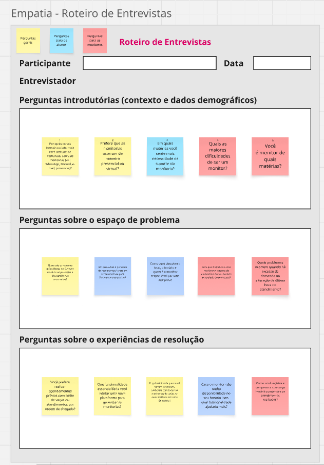
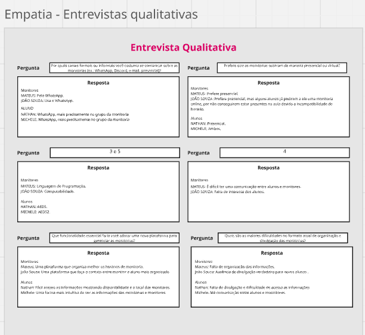
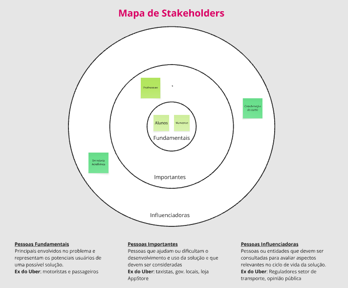
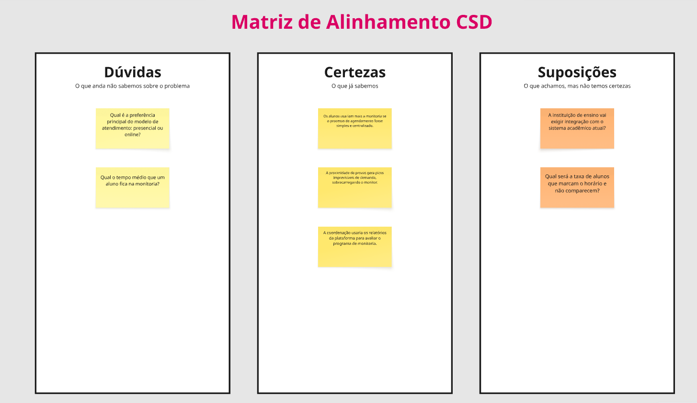
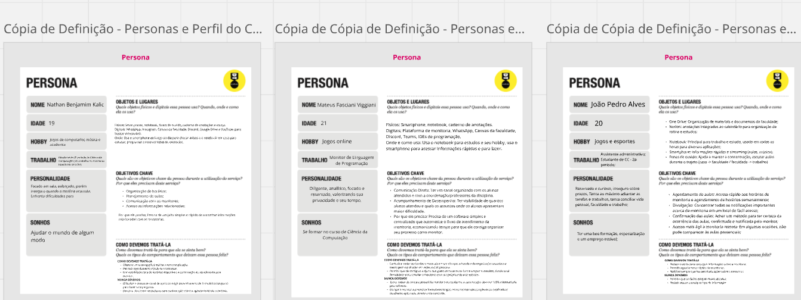
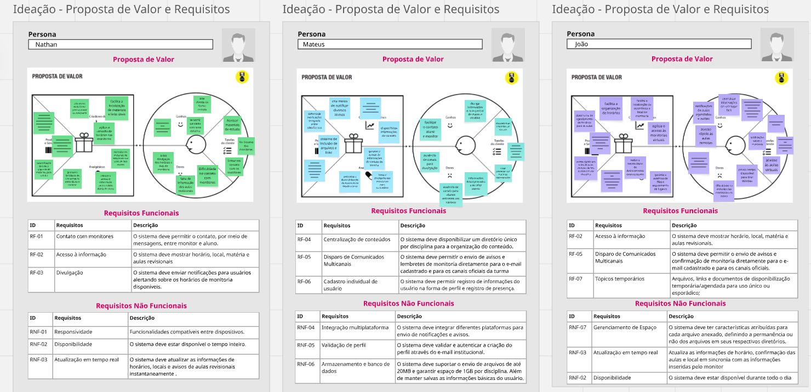
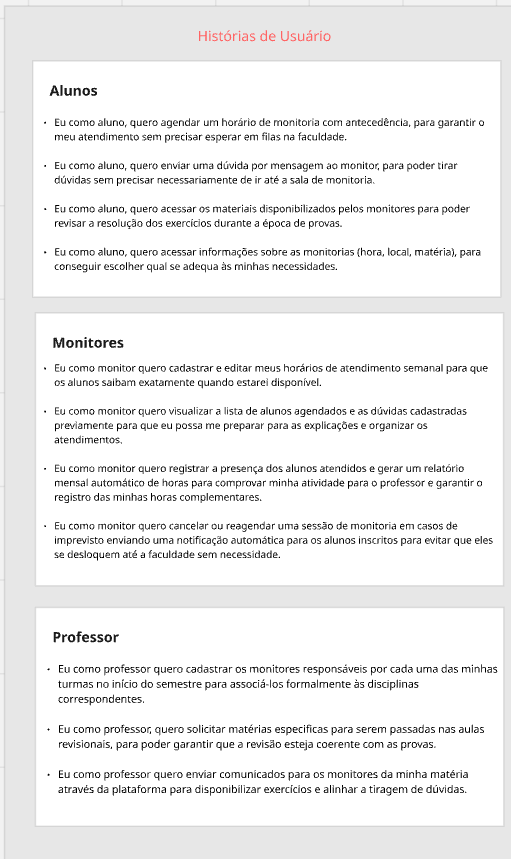
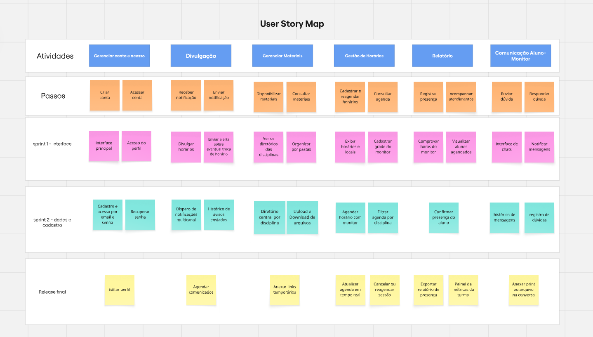
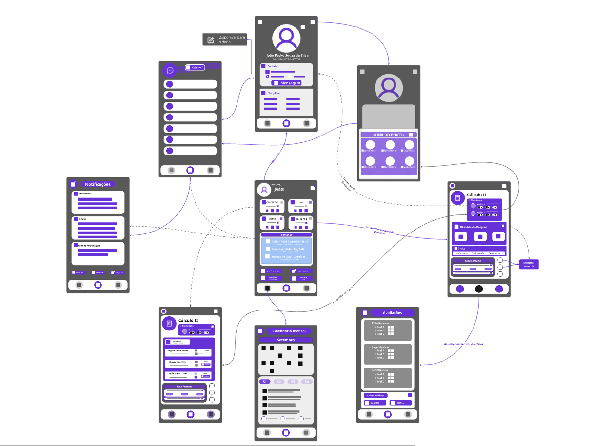
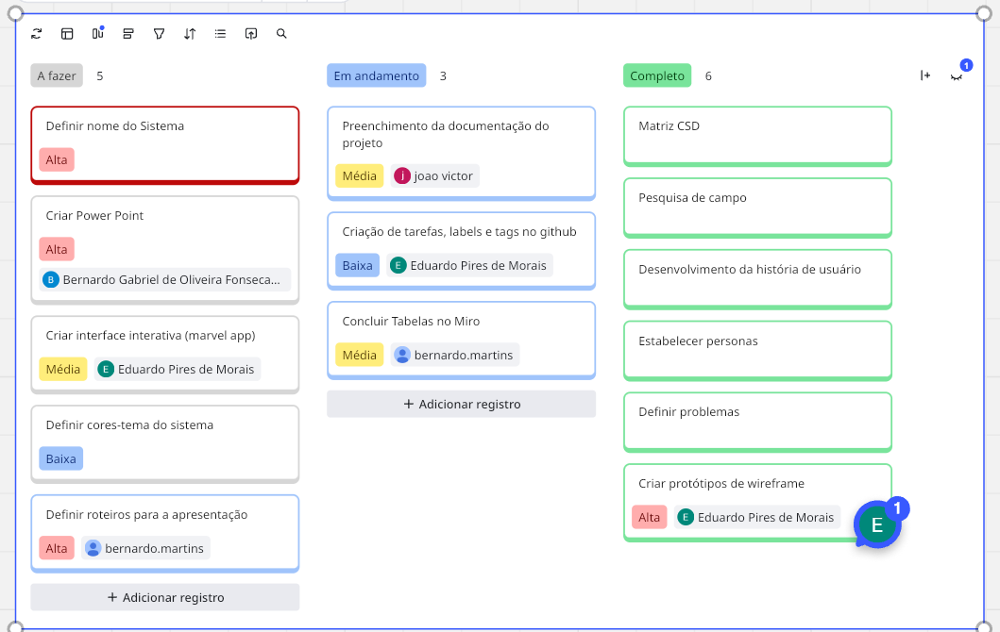

# Introdução

Informações básicas do projeto.

* **Projeto:** Mentora

* **Repositório GitHub:** https://github.com/ICEI-PUC-Minas-CC-TI/plu-cc-2026-2-ti2-4354100-plu-cc-2026-2-ti2-4354100-group-4/tree/master

* **Membros da equipe:**
* [João Victor Miranda Dorneles](https://github.com/jvmd1311-glitch) 
* [Bernardo Gabriel De Olivera Fonseca Saldanha](https://github.com/bernardogs04)
* [Bernardo Martins Takahashi Arruda](https://github.com/BernardoMartinsPuc)
* [Eduardo Pires De Morais](https://github.com/epmorais-arch)


## Sumário

1. [Contexto](#contexto)
   * [Problema](#problema) · [Objetivos](#objetivos) · [Justificativa](#justificativa) · [Público-Alvo](#público-alvo)
2. [Product Discovery](#product-discovery)
   * [Mapa de Stakeholders](#mapa-de-stakeholders) · [Matriz CSD](#matriz-csd) · [Pesquisa de Campo](#pesquisa-de-campo) · [Personas](#personas)
3. [Product Design](#product-design)
   * [Proposta de Valor](#proposta-de-valor) · [Histórias de Usuários](#histórias-de-usuários) · [Requisitos](#requisitos) · [User Story Map e Definição do MVP](#user-story-map-e-definição-do-mvp) · [Projeto de Interface](#projeto-de-interface)
4. [Metodologia](#metodologia)
   * [Ferramentas](#ferramentas) · [Gerenciamento do Projeto](#gerenciamento-do-projeto)
5. [Solução Implementada](#solução-implementada)
   * [Vídeo do Projeto](#vídeo-do-projeto) · [Funcionalidades](#funcionalidades) · [Minimundo](#minimundo) · [Estruturas de Dados](#estruturas-de-dados) · [Módulos e APIs](#módulos-e-apis)
6. [Referências](#referências)

---

# Contexto
A gestão de horários e o registro de presença dos monitores em atividades acadêmicas ainda são realizados, em muitos casos, de maneira manual e pouco organizada. O projeto busca solucionar essa dificuldade por meio de uma plataforma digital que centraliza o agendamento de horários, o controle de disponibilidade e o registro de ponto dos monitores, melhorando a organização da monitoria e a experiência de quem participa do processo.

## Problema
Muitos centros de monitoria e laboratórios ainda dependem de processos manuais ou ineficientes para organizar os horários dos monitores e registrar a presença no atendimento. Em muitos casos, a coordenação precisa acompanhar disponibilidade de forma pouco eficiente, enquanto os próprios monitores enfrentam dificuldades para agendar turnos, confirmar horários e registrar ponto.
Essa falta de organização pode gerar conflitos de escala, atrasos no atendimento, dificuldades na gestão de carga de trabalho e ausência de controle sobre a presença dos monitores. A partir disso, surge a necessidade de uma solução digital que centralize o agendamento de horários, simplifique a comunicação entre monitoria e estudantes e permita o registro de ponto de forma prática e segura.
A organização da monitoria acadêmica enfrenta dificuldades quanto a gestão de horários e o controle de presença,que são feitos de forma manual, por meio de planilhas, mensagens ou registros dispersos. Esse processo pode gerar conflitos de disponibilidade, falhas no acompanhamento dos atendimentos e ausência de um controle claro sobre o tempo de trabalho dos monitores. O problema acontece no contexto em que monitores, coordenadores e estudantes dependem de um sistema eficiente para agendar horários, organizar turnos e registrar ponto de forma confiável, sem depender de processos improvisados ou pouco estruturados.
## Objetivos

O objetivo geral deste trabalho é desenvolver um site para solucionar a má gestão de horários e do registro de presença dos monitores, oferecendo uma solução digital mais organizada, acessível e eficiente para coordenadores, monitores e estudantes.Temos em vista também melhorar a organização dos horários e turnos de monitoria, permitindo o agendamento de forma centralizada e com menor risco de conflitos de disponibilidade.Facilitar o controle de presença dos monitores, por meio de um registro de ponto mais prático, confiável e fácil de consultar.Reduzir a necessidade de processos manuais baseados em planilhas, mensagens e registros dispersos, promovendo uma gestão mais transparente e ágil da monitoria. E contribuir para uma melhor experiência de uso, com uma interface simples e funcional, que permita que os usuários realizem tarefas de forma intuitiva e sem dificuldades operacionais.


## Justificativa

A escolha deste tema se justifica pela dificuldade frequente observada na gestão de horários e no controle de presença dos monitores em atividades acadêmicas. Esse processo, quando realizado de forma manual, tende a gerar conflitos de disponibilidade, atrasos no atendimento, falhas de organização e pouca transparência na administração das monitorias. Como o problema afeta diretamente o desempenho da monitoria e a experiência de alunos, monitores e coordenadores, torna-se relevante desenvolver uma solução que torne esse processo mais eficiente e confiável.A função do projeto é criar uma plataforma digital que centralize o agendamento de horários, organize os turnos dos monitores e registre a presença de forma prática e segura. Dessa forma, a solução reduz a dependência de planilhas, mensagens e registros dispersos, promovendo uma gestão mais automatizada, clara e acessível. O sistema também contribui para melhorar a comunicação entre os envolvidos e facilitar o acompanhamento das atividades acadêmicas.O público-alvo do trabalho inclui monitores, coordenadores de monitoria e estudantes que dependem dos serviços de apoio acadêmico. Os monitores são os principais usuários do sistema, pois precisam gerenciar sua disponibilidade e registrar sua presença, os coordenadores precisam acompanhar e organizar o funcionamento geral da monitoria e os estudantes se beneficiam com atendimentos mais organizados e com acesso mais eficiente aos horários disponíveis.A base deste trabalho está fundamentada na observação direta do problema no contexto universitário, bem como na necessidade de melhorar processos acadêmicos por meio de soluções digitais. A justificativa também se apoia na relevância da tecnologia como ferramenta para otimizar atividades administrativas, reduzir falhas operacionais e melhorar a experiência dos usuários envolvidos na monitoria.






## Público-Alvo
O público-alvo do sistema são principalmente por pessoas diretamente envolvidas na organização e execução da monitoria acadêmica. O principal grupo de usuários são os monitores, que precisam gerenciar seus horários, confirmar disponibilidade e registrar presença durante os atendimentos. Esses usuários possuem conhecimento básico de tecnologia e utilizam ferramentas digitais de forma prática, mas exigem uma interface simples e intuitiva para realizar suas atividades sem dificuldades.Além dos monitores, o sistema também é voltado para coordenadores de monitoria e responsáveis pela gestão das atividades acadêmicas. Esse perfil é responsável por acompanhar a disponibilidade dos monitores, organizar os horarios e validar registros de presença.É relevante considerar os estudantes que utilizam os serviços de monitoria, pois dependem dos horários e da disponibilidade dos monitores. Embora seu contato direto com o sistema possa ser mais limitado, eles são parte do processo, pois o funcionamento da monitoria e a qualidade do atendimento influenciam diretamente sua experiência acadêmica. Dessa forma, o produto atende diferentes perfis com necessidades distintas, mas todos ligados à mesma finalidade, organizar melhor o processo de monitoria e facilitar o acesso ao atendimento.




# Product Discovery

Nesta etapa, aprofundamos a compreensão do problema escolhido a partir da perspectiva de quem o vivencia. O grupo levanta evidências de campo — não suposições — e as converte em artefatos que sustentam as decisões de produto tomadas na etapa de Product Design.

## Mapa de Stakeholders


## Matriz CSD




## Pesquisa de Campo


A pesquisa de campo revelou que a organização dos horários e o registro de presença dos monitores ainda são feitos de forma manual e pouco eficiente, gerando conflitos de disponibilidade, dificuldade de comunicação e falta de controle sobre os atendimentos. Esses achados foram essenciais para orientar o desenvolvimento das personas e as decisões de produto, em vez de basear-se apenas em suposições da equipe.

## Personas



A partir da pesquisa de campo, identificamos quatro personas principais envolvidas na gestão de monitoria acadêmica:

1. Monitor Acadêmico
**Mapa de empatia:**
- **Pensa:** "Quero organizar meu horário sem conflitos e registrar minha presença facilmente."
- **Sente:** Ansiedade com sobrecarga de tarefas e insegurança em relação ao controle de ponto.
- **Ouve:** Solicitações de coordenação, dúvidas dos estudantes e necessidade de manter presença regular.
- **Vê:** Planilhas, mensagens e registros manuais que dificultam a organização.
- **Faz:** Confirma turnos, gerencia disponibilidade e registra atendimento.
- **Deseja:** Uma solução simples para agendar horários e registrar presença sem erros.

2. Coordenador de Monitoria
**Mapa de empatia:**
- **Pensa:** "Preciso organizar turnos com eficiência e acompanhar a presença dos monitores."
- **Sente:** Pressão para manter a monitoria funcionando sem conflitos e atrasos.
- **Ouve:** Relatos de monitores e estudantes sobre dificuldades de organização.
- **Vê:** Falhas em registros manuais e baixa visibilidade sobre a disponibilidade dos monitores.
- **Faz:** Distribui horários, valida presença e organiza a escala.
- **Deseja:** Controle centralizado da monitoria e redução de conflitos.

3. Estudante
**Mapa de empatia:**
- **Pensa:** "Quero encontrar horários claros e confiáveis para receber ajuda acadêmica."
- **Sente:** Frustração ao não encontrar atendimento disponível ou organizado.
- **Ouve:** Indicações de colegas, professores e grupos de comunicação.
- **Vê:** Horários pouco claros e comunicação dispersa.
- **Faz:** Busca monitoria e participa dos atendimentos.
- **Deseja:** Acesso rápido e eficiente aos horários dos monitores.

4. Professor Responsável
**Mapa de empatia:**
- **Pensa:** "A monitoria deve apoiar a disciplina de forma organizada e eficiente."
- **Sente:** Preocupação com a qualidade do suporte acadêmico e a organização da rotina.
- **Ouve:** Dúvidas e pedidos dos estudantes sobre horários e atendimento.
- **Vê:** Falhas na comunicação e ausência de controle sobre a presença dos monitores.
- **Faz:** Acompanha a atuação da monitoria e valida o funcionamento dos atendimentos.
- **Deseja:** Maior transparência e organização no processo de monitoria.

Essas personas mostram que a solução deve atender diferentes perfis, mas com um objetivo comum: melhorar a organização de horários, facilitar a comunicação e garantir um controle mais confiável da presença dos monitores.

# Product Design

Nesse momento, vamos transformar os insights e validações obtidos em soluções tangíveis e utilizáveis. Essa fase envolve a definição de uma proposta de valor, a redação das histórias de usuário, a organização de tudo em um User Story Map e a criação de wireframes, mockups e protótipos que detalham a interface e a experiência do usuário.

## Proposta de Valor




## Histórias de Usuários

Com base na análise das personas foram identificadas as seguintes histórias de usuários:

| EU COMO...`PERSONA` | QUERO/PRECISO ...`FUNCIONALIDADE` | PARA ...`MOTIVO/VALOR` |
| --------------------- | ---------------------------------- | ---------------------- |
| Monitor acadêmico | Agendar meus horários de atendimento e visualizar minha disponibilidade | Organizar melhor minha rotina e evitar conflitos de agenda |
| Coordenador de monitoria | Definir turnos, acompanhar presença e verificar os horários dos monitores | Garantir organização e controle eficiente da monitoria |
| Estudante | Consultar os horários disponíveis e entrar em contato com o monitor | Receber ajuda acadêmica no momento adequado |
| Professor responsável | Acompanhar a atuação da monitoria e validar os registros de presença | Melhorar o suporte pedagógico e a qualidade do atendimento |

Essas histórias representam as necessidades centrais do sistema, conectando as diferentes personas ao objetivo principal de organizar horários, facilitar a comunicação e controlar a presença dos monitores.



## Requisitos

As tabelas que se seguem apresentam os requisitos funcionais e não funcionais que detalham o escopo do projeto.

### Requisitos Funcionais

| ID     | Descrição do Requisito | Prioridade |
| ------ | ---------------------- | ---------- |
| RF-001 | Permitir que o monitor cadastre sua disponibilidade de horários para atendimento | ALTA |
| RF-002 | Permitir que o monitor consiga bater o ponto registrando o horario do inicio e de saida | ALTA |
| RF-003 | Permitir que o estudante consulte os horários disponíveis da monitoria | ALTA |
| RF-004 | Permitir que o monitor registre sua presença em cada turno realizado | ALTA |
| RF-005 | Permitir que o coordenador visualize os registros de presença e o desempenho dos monitores | MÉDIA |
| RF-006 | Permitir que o professor acompanhe a atuação da monitoria e os atendimentos realizados | MÉDIA |

### Requisitos não Funcionais

| ID      | Descrição do Requisito | Prioridade |
| ------- | ---------------------- | ---------- |
| RNF-001 | O sistema deve ser responsivo e compatível com uso em desktop e dispositivos móveis | MÉDIA |
| RNF-002 | A interface deve ser intuitiva, clara e de fácil utilização para monitores, coordenadores, estudantes e professores | ALTA |
| RNF-003 | Os dados de horários, turnos e presença devem ser armazenados com consistência e segurança | ALTA |
| RNF-004 | O sistema deve apresentar informações de agenda e presença com tempo de resposta rápido | MÉDIA |


## User Story Map e Definição do MVP


**Sprint 1 - MVP**  Cadastro e acesso por e-mail e senha; definição de cargos; divulgação de horários; alertas sobre troca de horário; visualização, download e upload de materiais; exibição de horários e locais; cadastro de monitor; comprovação das horas do monitor; interface para envio de mensagens e notificação de mensagens. 

**Sprint 2**  Recuperação de senha; notificações multicanal; diretório central por disciplina; organização de materiais por pastas; agendamento com o monitor; filtros de agenda por disciplina; confirmação de presença pelo aluno; visualização de alunos agendados; histórico de dúvidas. 

**Sprint 3** Edição de perfil; agendamento de comunicados; histórico de avisos enviados; anexação de links temporários; atualização da agenda em tempo real; cancelamento ou reagendamento de sessão; exportação do relatório de presença; painel de métricas da turma; anexação de prints ou arquivos na conversa.

Assim, o **MVP corresponde à Sprint 1**, pois entrega o fluxo essencial de acesso, organização da monitoria, consulta de informações, registro das horas e comunicação básica. As Sprints 2 e 3 ampliam a solução com recursos de recuperação, filtragem, acompanhamento, histórico, relatórios e colaboração.

## Projeto de Interface

Artefatos relacionados com a interface e a interacão do us

## Projeto de Interface

Artefatos relacionados com a interface e a interacão do usuário na proposta de solução.

### Wireframes

Estes são os protótipos de telas do sistema.
<br>
<br>

**Tela de login**

Primeira tela que o usuário acessa, sendo possível visualizar o logotipo do sistema, logo da instituição, descrição das atividades desenvolvidas no programa e campos para e-mail-senha e código de acesso.

>> protótipo principal da página de login

<br>

**Tela inicial do sistema**

Apresenta a visão geral das disciplinas, acesso rápido ao perfil e o planejamento semanal, barra lateral para navegação rápida e ações rápidas, como agendar novos horários, criar um novo lembrete, visualizar as disciplinas disponíveis e links para as monitorias online

>> <sub>protótipo da página inicial do sistema


<br>

**Página de notificações**

Apresenta a visão geral das notificações com barras de progresso que demonstram a proporção entre as notificações vindas de chats e notificações vindas de avisos e lembretes. Também possui uma interface para criar eventos, gerar novo comunicado, adicionar um lembrete ou editar algum lembrete criado por você. as notificações são distribuídas em campos que as separam em tags, facilitando o acesso e visualização das notificações

>> <sub>protótipo da página de notificações


<br>

**Página de perfil e compartilhamento**

Apresenta a visão dos dados de um usuário e o permite visualizar as disciplinas, informações de contato pessoal e os agendamentos mais recentes. Ao apertar no ícone de compartilhamento, a página exibe o link do perfil e atalhos para enviar o perfil para outro chat.

>> <sub>protótipo principal do perfil


>>> <sub>protótipo de compartilhamento
>>>
<br>

**Página de calendário**

Apresenta a visualização mensal dos lembretes e datas. Permite a mudança de visualização (mensal -> semanal), agendar novo evento, criar aleta e editar algum dos eventos já criados. Os eventos criados são divididos por tags específicas e mostra a descrição de cada um e um circulo mostrando a proporção entre alertas totais e cada uma das tags.

>> <sub>protótipo do calendário integrado

<br>

**Página inicial das Disciplinas**

Apresenta a visão geral das disciplinas, acesso rápido à informação dos monitores, próximos eventos agendados para a disciplina, calendário mensal e acesso rápido aos diretórios individuais de cada disciplina.

>> <sub>Protótipo da página inicial da disciplina

<br>

**Agendamento de Horários**

Apresenta a página de disponibilidade de cada um dos monitores. Para cada um deles, uma barra de rolagem permitindo a visualização do horário, local, quantidade de vagas disponíveis, botão para ativar notificações de alteração e disponibilidade, edição de horários (para o monitor) e disponibilidade do link para monitoria online.

>> <sub>protótipo de campos de agendamento

<br>

**Edição de data e configuração de notificações**

Ao apertar o botão de editar, o monitor poderá editar as informações acerca do seu horário de monitoria, descrição da aula, data/hora, local(campus, prédio e andar) e adicionar tags para a aula (Aulão, resulução de lista, revisão, etc...). Após alterar alguma informação, terá a opção de agendar ou enviar a notificação imediatamente, ajudando a controlar melhor a dinâmica de avisos. Cada aula marcada com tags deverá ter um comportamento diferente ordenada pela seleção (aulões serão notificados para todos os alunos com cadastro na disciplina, por exemplo).

>> <sub>protótipo de seleção de data, tag e descrição


>> <sub>protótipo de seleção de local da monitoria


<br>

**Arquivos e diretórios da disciplina**

Apresenta a página de materiais e links de ancoragem dos respectivos arquivos, com o nome do arquivo e uma pequena descrição. Serão organizados entre Materiais de estudo, Provas antigas, listas e uma parte dedicada a links temporários que devem ser usados para anexar links para uso esporádico ou em um contexto específico de uma aula.

>> <sub>protótipo de arquivos da disciplina


<br>

**Seleção de chats**

Apresenta todos os chats recentes e permite o filtro de busca para encontrar conversas recentes ou específicas. Cada conversa com o usuário apresenta sua foto/ícone de perfil, nome e a ultima mensagem do chat. Cada chat poderá ser marcada com tags (divisão por disciplina, monitor, professor ou favoritos) para facilitar a organização. Ao lado da aba página principal, poderão ser visualizados os monitores com os quais o usuário já teve contato a partir de um menu colapsável.

>> <sub>protótipo da lista de chats recentes


<br>

**Chat direto**

Ao acessar qualquer botão de mensagem, o usuário é direcionado a uma página permite a troca de mensagens entre dois usuários, permitindo o anexo de links e imagens. Ao posicionar o mouse ao lado de uma mensagem, é possível marcar ela com uma tag de dúvida e atribuir um nome (titulo). Após isso, os usuários podem acessar as dúvidas a partir de uma barra lateral, permitindo a edição, resposta ou exclusão da dúvida. Um usuário pode responder à própria dúvida ou a uma dúvida do outro usuário a partir do mesmo menu ao lado de uma mensagem, permitindo-o selecionar uma dúvida e marcando a mensagem como uma resposta ou a partir da barra lateral de visualização. Ao lado da página das mensagens, é possível visualizar as informações públicas do outro usuário juntamente ao seu tipo (aluno, professor, monitor).

>> <sub>protótipo de interface de conversa entre usuários


<br>
<br>

### User Flow




### Protótipo Interativo

✅ [Protótipo Interativo (MarvelApp)](https://marvelapp.com/prototype/1d1e1ae9)  


<iframe src="https://marvelapp.com/prototype/1d1e1ae9" width="100%" height="auto"></iframe>

# Metodologia

Detalhes sobre a organização do grupo e o ferramental empregado.

## Ferramentas

Relação de ferramentas empregadas pelo grupo durante o projeto.

| Ambiente | Plataforma | Link de acesso |
| -------- | ---------- | -------------- |
| Processo de Design Thinking | Miro | [Board de Design Thinking](https://miro.com/app/board/uXjVHy5TQHE=/) |
| Repositório e versionamento do código | GitHub | [Repositório do projeto](https://github.com/ICEI-PUC-Minas-CC-TI/plu-cc-2026-2-ti2-4354100-plu-cc-2026-2-ti2-4354100-group-4) |
| Desenvolvimento da aplicação | Visual Studio Code, HTML, CSS e JavaScript | [Código da aplicação](../codigo/) |
| HOSPEDAGEM DO SITE...
| Protótipos de interface | Xournal++ | [Página principal](https://xournalpp.github.io) |

O Miro foi utilizado para organizar as atividades de Design Thinking e os artefatos de descoberta e ideação. O GitHub foi utilizado para armazenar e versionar o código do projeto. **hospedagem do site**. Os protótipos de interface foram registrados nos wireframes incluídos neste documento, feitos manualmente pelo programa Xournal++ disponível para MacOs, Windows e Linux e estão disponíveis na pasta [wireframes](images/wireframes) desse repositório.

## Gerenciamento do Projeto

Divisão de papéis no grupo e apresentação da estrutura da ferramenta de controle de tarefas (Kanban), utilizada para acompanhar o backlog do produto e o andamento das três sprints.



O desenvolvimento do projeto foi organizado em duas etapas principais. Na fase de Design Thinking, o grupo investigou o problema da organização das monitorias acadêmicas, identificou os principais stakeholders e perfis de usuários, realizou a pesquisa de campo e estruturou personas, proposta de valor, histórias de usuário e requisitos. Esses artefatos orientaram a definição das funcionalidades e do MVP.

Na fase de Implementação, o grupo utilizou o framework Scrum para organizar o desenvolvimento em três sprints. A **Sprint 1** concentrou o desenvolvimento de interfaces e o início do desenvolvimento da estrutura de dados, com acesso ao sistema, consulta de horários e materiais, cadastro de monitor, registro das horas e comunicação básica. A **Sprint 2** ampliou o sistema com recuperação de senha, filtros, agendamento, confirmação de presença e histórico. A **Sprint 3** reuniu recursos complementares, como edição de perfil, atualização da agenda, reagendamento, relatórios e métricas.

O acompanhamento das tarefas foi realizado por meio de um quadro Kanban, apresentado acima. As atividades foram organizadas nas colunas **A fazer**, **Em andamento** e **Completo**, permitindo visualizar o progresso do trabalho e identificar as próximas entregas. Cada cartão contém a tarefa, a prioridade e, quando aplicável, o integrante responsável, facilitando a divisão de responsabilidades e o acompanhamento do status da solução.

# Solução Implementada

Esta seção apresenta todos os detalhes da solução criada no projeto.

## Vídeo do Projeto

O vídeo a seguir traz uma apresentação do problema que a equipe está tratando e a proposta de solução. ⚠️ EXEMPLO ⚠️

[](https://www.youtube.com/embed/70gGoFyGeqQ)

<details>
<summary>⚠️ Como preencher esta seção (apague antes de entregar)</summary>

O vídeo de apresentação é voltado para que o público externo possa conhecer a solução. O formato é livre, sendo importante que seja apresentado o problema e a solução numa linguagem descomplicada e direta. Inclua um link para o vídeo do projeto.

</details>

## Funcionalidades

Esta seção apresenta as funcionalidades da solução.

### Funcionalidade 1 - Cadastro de Contatos ⚠️ EXEMPLO ⚠️

Permite a inclusão, leitura, alteração e exclusão de contatos para o sistema

* **Estrutura de dados:** Contatos
* **Instruções de acesso:**
  * Abra o site e efetue o login
  * Acesse o menu principal e escolha a opção Cadastros
  * Em seguida, escolha a opção Contatos
* **Tela da funcionalidade**:


<details>
<summary>⚠️ Como preencher esta seção (apague antes de entregar)</summary>

Apresente cada uma das funcionalidades que a aplicação fornece tanto para os usuários quanto aos administradores da solução.

Inclua, para cada funcionalidade, itens como: (1) título e descrição da funcionalidade; (2) estrutura de dados associada; (3) instruções de acesso e uso.

</details>

## Minimundo

**✳️✳️✳️ DESCREVA AQUI O MINIMUNDO DO SEU NEGÓCIO ✳️✳️✳️**

<details>
<summary>⚠️ Como preencher esta seção (apague antes de entregar)</summary>

O minimundo é uma descrição textual do negócio por trás da sua aplicação: quais são as principais entidades envolvidas (por exemplo, usuários, produtos, pedidos), como elas se relacionam entre si e quais regras de negócio existem. É a partir dessa descrição que o grupo desenha o modelo de dados apresentado na seção seguinte.

</details>

## Estruturas de Dados

Descrição das estruturas de dados utilizadas na solução, com exemplos no formato JSON. No projeto, os dados ficam armazenados no arquivo `codigo/db/db.json` e são servidos automaticamente pelo **JSON Server**: cada chave de nível superior desse arquivo vira uma coleção com sua própria API RESTful (`GET`, `POST`, `PUT`, `DELETE`), sem que seja necessário programar um banco de dados à parte.

### Estrutura de Dados - Contatos ⚠️ EXEMPLO ⚠️

Contatos da aplicação

```json
{
  "id": 1,
  "nome": "Leanne Graham",
  "cidade": "Belo Horizonte",
  "categoria": "amigos",
  "email": "Sincere@april.biz",
  "telefone": "1-770-736-8031",
  "website": "hildegard.org"
}
```

### Estrutura de Dados - Usuários ⚠️ EXEMPLO ⚠️

Registro dos usuários do sistema, utilizado para login e para o perfil do sistema

```json
{
  "id": 1,
  "login": "admin",
  "senha": "123",
  "nome": "Administrador do Sistema",
  "email": "admin@abc.com"
}
```

<details>
<summary>⚠️ Como preencher esta seção (apague antes de entregar)</summary>

Apresente as estruturas de dados utilizadas na solução, tanto para os dados que fazem parte da essência da aplicação quanto outras estruturas criadas para algum tipo de configuração. Nomeie a estrutura, coloque uma descrição sucinta e apresente um exemplo em formato JSON correspondente a uma das coleções do `db.json`.

**Orientações:**

- [JSON Introduction](https://www.w3schools.com/js/js_json_intro.asp)
- [Trabalhando com JSON - Aprendendo desenvolvimento web | MDN](https://developer.mozilla.org/pt-BR/docs/Learn/JavaScript/Objects/JSON)

</details>

## Módulos e APIs

Esta seção apresenta os módulos e APIs utilizados na solução.

**Images**:

* Unsplash - [https://unsplash.com/](https://unsplash.com/) ⚠️ EXEMPLO ⚠️

**Fonts:**

* Icons Font Face - [https://fontawesome.com/](https://fontawesome.com/) ⚠️ EXEMPLO ⚠️

**Scripts:**

* jQuery - [http://www.jquery.com/](http://www.jquery.com/) ⚠️ EXEMPLO ⚠️
* Bootstrap 4 - [http://getbootstrap.com/](http://getbootstrap.com/) ⚠️ EXEMPLO ⚠️

<details>
<summary>⚠️ Como preencher esta seção (apague antes de entregar)</summary>

Apresente os módulos e APIs utilizados no desenvolvimento da solução. Inclua itens como: (1) frameworks, bibliotecas, módulos, etc. utilizados no desenvolvimento da solução; (2) APIs utilizadas para acesso a dados, serviços, etc.

</details>

---

# Referências

As referências utilizadas no trabalho foram:

* SOBRENOME, Nome do autor. Título da obra. 8. ed. Cidade: Editora, 2000. 287 p ⚠️ EXEMPLO ⚠️

<details>
<summary>⚠️ Como preencher esta seção (apague antes de entregar)</summary>

Inclua todas as referências (livros, artigos, sites, etc.) utilizados no desenvolvimento do trabalho.

**Orientações**:

- [Formato ABNT](https://www.normastecnicas.com/abnt/trabalhos-academicos/referencias/)
- [Referências Bibliográficas da ABNT](https://comunidade.rockcontent.com/referencia-bibliografica-abnt/)

</details>
